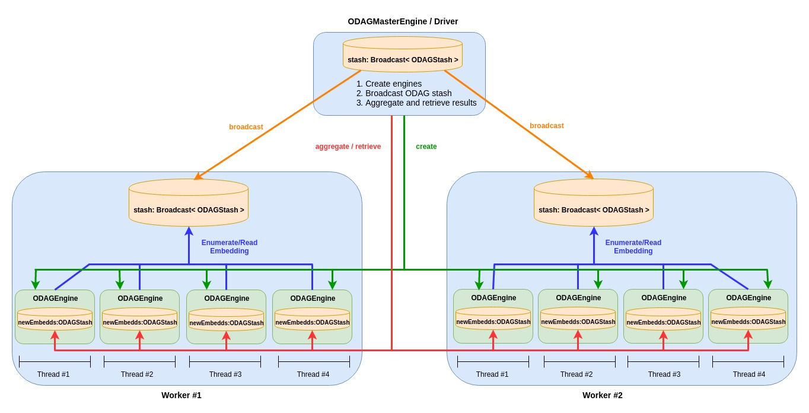

# Component diagram of computation engines

This document describes the architecture and interaction of the computation engines (Master/Workes)

 

 
The master engine repeats the following steps till no more possible results or reaches the desired embedding/pattern size:

1. Creates a *stash* of ODAGs (embty for the first step only)
2. Creates a list of **ODAGEngine** objects, each is associated with a partition and has a unique idenifier **partitionId** (Usually the number of partitions is equivalent to the number of threads)
3. Broadcasts the *stash* to the workers, such that all the engines residing in a single worker share the same copy of the ODAG stash.
4. Waits till all engines finish hteir computing their partitions. Then retrieve and aggrgate the new ODAGs in order to send them to the new engines in the next step.

 
Each engine performs the following steps:

1. Determines which enumerations/embeddings to read from each ODAG. This set of enumerations is generated from an ODAG using a load balancing algorithm mentioned in the paper in section 5.3
2. For each embedding read, the engine expands it generating a set of new embeddings
3. The new expanded embeddings go through the filter/process operations of the Arabesque programming model
4. The set of embeddings survived from the filteration phase are being added to the newEmbedds ODAG stash. Those new stashes are being aggregatd from the engines and retrieved by the master engine
