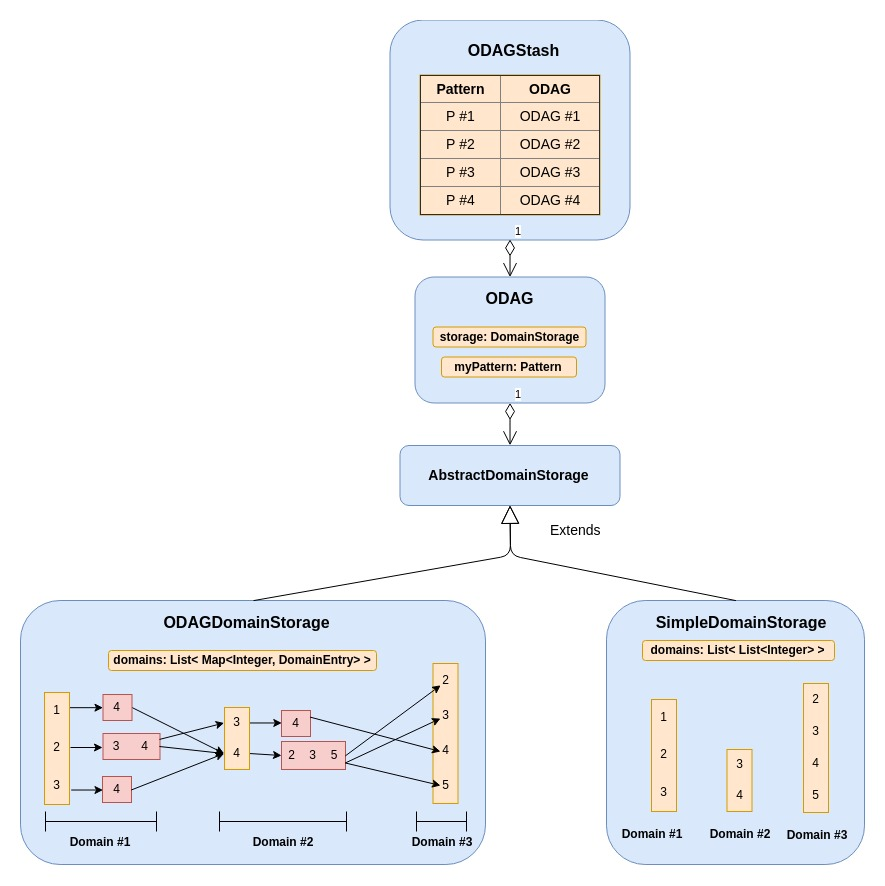

# Hierarchy of the ODAG data structure

This document describes the internals of the ODAG data structure.

 

 

The list of ODAGs are stored in a data structure called **ODAGStash** which stores the odags as a map of key/value pairs, where each map entry has:
 + An **ODAG** object as the value
 + A **Pattern** object as the key that the corresponding odag follows
 
Each **ODAG** encapsulates
 + Intenal storage of type **DomainStorage** which comes in many variations. Please refer to the class diagram of [ODAGs](./resources/ClassDiag/ODAG/general.png)
 + **Pattern** which this ODAg follows
 
A **DomainStorage** is the core storage of an ODAG where the list of embeddings are compressed. There two main methods of compression (Simple and ODAG that are illustated [here](./resources/)). Each domain storage consists of a list of maps, where each map represents a domain. A domain represents the 

